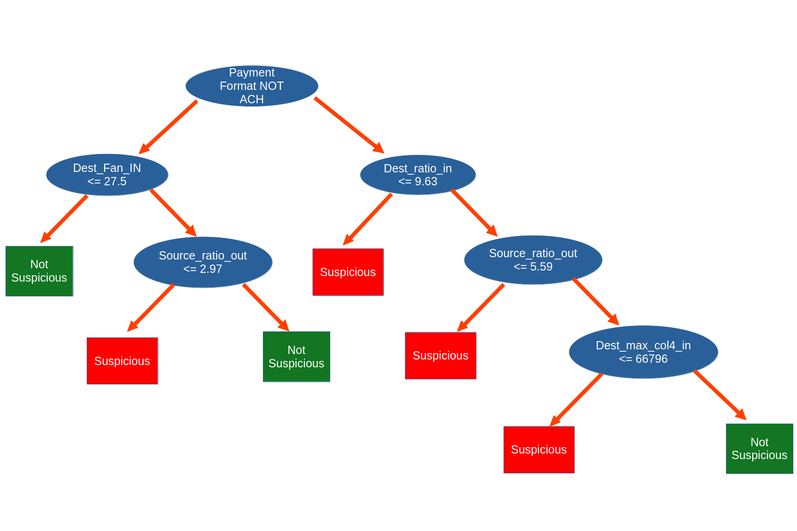

# AML Transaction Alert
The table below provides information regarding a transaction that the model has identified as suspicious. The data features are those that are used by the decision tree. All others are excluded. Please review the **Feature Definitions** below to understand what the feature names mean and how they can be interpreted.

|Features         |Value            |
|:----------------|:----------------|
|Payment Format   |ACH              |
|dest_fan_in      |2                |
|source_ratio_out |6.67             |
|dest_ratio_in    |1.5              |
|dest_max_col4_in |17132.78         |
|Bank Name        |Russia Bank #25  |
|Entity Type      |Corporation      |

# Model Decision Algorithm - Decision Tree
A decision tree is a predictive model that makes decisions by following a flowchart-like series of simple "if-then" or "yes/no" questions based on data features.
- **The Structure**: It starts at a single top rule (the root) and splits into branches based on each answer. Following the path through subsequent questions leads to an end point (a leaf), which provides the final prediction or classification.
- **Why It Matters**: Unlike "black-box" machine learning models, decision trees are inherently transparent because you can directly trace the exact visual path and logic that produced an outcome.

# Feature Definitions
1. dest_fan_in
- *The Investigator Translation*: "The Gathering Pool" or "Number of Unique Depositors."
- *The Mechanics*: This metric looks at the account receiving the money (the destination). It simply counts the number of distinct source accounts that have sent money to this single destination account over a specific timeframe.
- *The Fraud Typology*: A high fan-in (like the > 27.5 threshold in the tree) is a classic topological signature of a "funnel account." In many scams, or in distributed money laundering (smurfing), criminals use a network of compromised victim accounts or money mules to pool illicit funds into a central hub. Legitimate retail accounts rarely receive transfers from dozens of different, unrelated accounts simultaneously.
2. source_ratio_out
- *The Investigator Translation*: "The Outbound Imbalance" or "Burn Rate."
- *The Mechanics*: This focuses on the account sending the money. It measures the ratio of the account's outbound transaction volume (or count) compared to its inbound volume or historical baseline.
- *The Fraud Typology*: A high outbound ratio indicates an account is flushing money out much faster than it is taking legitimate funds in. This is the exact behavior of an intermediary mule account or a newly compromised account, where the immediate goal is to wire stolen funds away to a secondary destination before the bank can initiate a clawback or freeze the assets.
3. dest_ratio_in
- *The Investigator Translation*: "The Inbound Imbalance" or "Sudden Influx."
- *The Mechanics*: The mirror image of the metric above, looking at the receiving account. It measures how heavily the account's recent activity is dominated by incoming funds compared to its outgoing funds or baseline history.
- *The Fraud Typology*: If an account that typically has a balanced ratio of deposits to daily spending suddenly experiences a massive spike where the ratio is heavily skewed toward incoming transfers, it is highly suspicious. This pattern flags "sleeper accounts" or older, seemingly legitimate accounts that have suddenly been activated strictly to receive large fraudulent disbursements.
4. dest_max_col4_in
- *The Investigator Translation*: "The Single Largest Deposit."
- *The Mechanics*: Assuming col4 represents the transaction amount (given the specific $66,796.01 threshold in the model), this feature isolates the absolute largest single incoming transaction to the destination account during the tracking window.
- *The Fraud Typology*: Even if an account doesn't trigger the "Gathering Pool" alert (low fan-in), receiving a massive, outlier payday is a major red flag. This node is designed to catch high-value, low-frequency events like a targeted wire fraud payment, a business email compromise (BEC) settlement, or a ransomware payout, where the illicit transfer occurs in a single, massive lump sum rather than a distributed pool. 

# Transaction History
This is the history of transactions for this particular Account. This is to provide an investigator with some potential context for the transactions.

|         |Timestamp           |Account   |ReceivingAccount |FromBank |ToBank |PaymentFormat | dest_fan_in| source_ratio_out| dest_ratio_in| dest_max_col4_in|
|:--------|:-------------------|:---------|:----------------|:--------|:------|:-------------|-----------:|----------------:|-------------:|----------------:|
|81742    |2022-09-01 00:01:00 |81B76EF90 |81B76EF90        |172128   |172128 |Reinvestment  |           2|         7.250000|          3.00|        344748.13|
|1079552  |2022-09-01 00:24:00 |81B76EF90 |81B76EF90        |172128   |172128 |Reinvestment  |           2|         7.250000|          3.00|        344748.13|
|1667917  |2022-09-01 03:08:00 |81B76EF90 |81B76ECF0        |172128   |275092 |ACH           |           1|         7.250000|          1.00|       4391369.00|
|3402368  |2022-09-01 16:04:00 |81B76EF90 |81CD344A0        |172128   |75129  |Credit Card   |           4|         7.250000|          7.75|     189313787.67|
|3431474  |2022-09-01 16:17:00 |81B76EF90 |81CD344A0        |172128   |75129  |Cheque        |           4|         7.250000|          7.75|     189313787.67|
|5343967  |2022-09-02 06:37:00 |81B76EF90 |81CD344A0        |172128   |75129  |Credit Card   |           4|         7.250000|          7.75|     189313787.67|
|5365576  |2022-09-02 06:48:00 |81B76EF90 |81CD344A0        |172128   |75129  |Cheque        |           4|         7.250000|          7.75|     189313787.67|
|9571419  |2022-09-05 04:41:00 |81B76EF90 |81CD344A0        |172128   |75129  |Cheque        |           4|         7.250000|          7.75|     189313787.67|
|9582749  |2022-09-05 04:50:00 |81B76EF90 |81CD344A0        |172128   |75129  |Credit Card   |           4|         7.250000|          7.75|     189313787.67|
|11260995 |2022-09-06 01:37:00 |81B76EF90 |81CD344A0        |172128   |75129  |Credit Card   |           4|         7.250000|          7.75|     189313787.67|
|11280328 |2022-09-06 01:52:00 |81B76EF90 |81CD344A0        |172128   |75129  |Cheque        |           4|         7.250000|          7.75|     189313787.67|
|13695709 |2022-09-07 08:05:00 |81B76EF90 |81CD344A0        |172128   |75129  |Cheque        |           4|         7.250000|          7.75|     189313787.67|
|13718063 |2022-09-07 08:22:00 |81B76EF90 |81CD344A0        |172128   |75129  |Credit Card   |           4|         7.250000|          7.75|     189313787.67|
|15867877 |2022-09-08 11:11:00 |81B76EF90 |81CD344A0        |172128   |75129  |Cheque        |           4|         7.250000|          7.75|     189313787.67|
|15876460 |2022-09-08 11:18:00 |81B76EF90 |81CD344A0        |172128   |75129  |Credit Card   |           4|         7.250000|          7.75|     189313787.67|
|18166845 |2022-09-09 11:37:00 |81B76EF90 |81CD344A0        |172128   |75129  |Cheque        |           4|         7.250000|          7.75|     189313787.67|
|18181724 |2022-09-09 11:45:00 |81B76EF90 |81CD344A0        |172128   |75129  |Credit Card   |           4|         7.250000|          7.75|     189313787.67|
|22691006 |2022-09-12 19:02:00 |81B76EF90 |81CD344A0        |172128   |75129  |Credit Card   |           4|         7.250000|          7.75|     189313787.67|
|22724808 |2022-09-12 19:28:00 |81B76EF90 |81CD344A0        |172128   |75129  |Cheque        |           4|         7.250000|          7.75|     189313787.67|
|22823167 |2022-09-12 20:43:00 |81B76EF90 |81B76F7D0        |172128   |28     |ACH           |           7|         7.250000|          2.00|        284612.46|
|23926555 |2022-09-13 10:08:00 |81B76EF90 |8038C8540        |172128   |14031  |ACH           |           2|         6.666667|          1.50|         17132.78|
|23926564 |2022-09-13 10:08:00 |81B76EF90 |81B76EF90        |172128   |172128 |ACH           |           8|         6.666667|          2.00|       1332999.18|
|24365040 |2022-09-13 15:45:00 |81B76EF90 |81CD344A0        |172128   |75129  |Cheque        |           4|         6.666667|         10.50|     189313787.67|
|24376751 |2022-09-13 15:54:00 |81B76EF90 |81CD344A0        |172128   |75129  |Credit Card   |           4|         6.666667|         10.50|     189313787.67|
|25968289 |2022-09-14 11:33:00 |81B76EF90 |81CD344A0        |172128   |75129  |Cheque        |           4|         6.666667|         10.50|     189313787.67|
|25979820 |2022-09-14 11:41:00 |81B76EF90 |81CD344A0        |172128   |75129  |Credit Card   |           4|         6.666667|         10.50|     189313787.67|
|26295340 |2022-09-14 15:44:00 |81B76EF90 |81B76EB60        |172128   |274634 |ACH           |           7|         6.666667|          1.00|        336942.03|
|27787695 |2022-09-15 10:06:00 |81B76EF90 |81CD344A0        |172128   |75129  |Credit Card   |           4|         6.666667|         10.50|     189313787.67|
|27789781 |2022-09-15 10:08:00 |81B76EF90 |81CD344A0        |172128   |75129  |Cheque        |           4|         6.666667|         10.50|     189313787.67|
|29566209 |2022-09-16 05:09:00 |81B76EF90 |81CD344A0        |172128   |75129  |Credit Card   |           4|         6.666667|         10.50|     189313787.67|
|29566210 |2022-09-16 05:09:00 |81B76EF90 |81CD344A0        |172128   |75129  |Cheque        |           4|         6.666667|         10.50|     189313787.67|